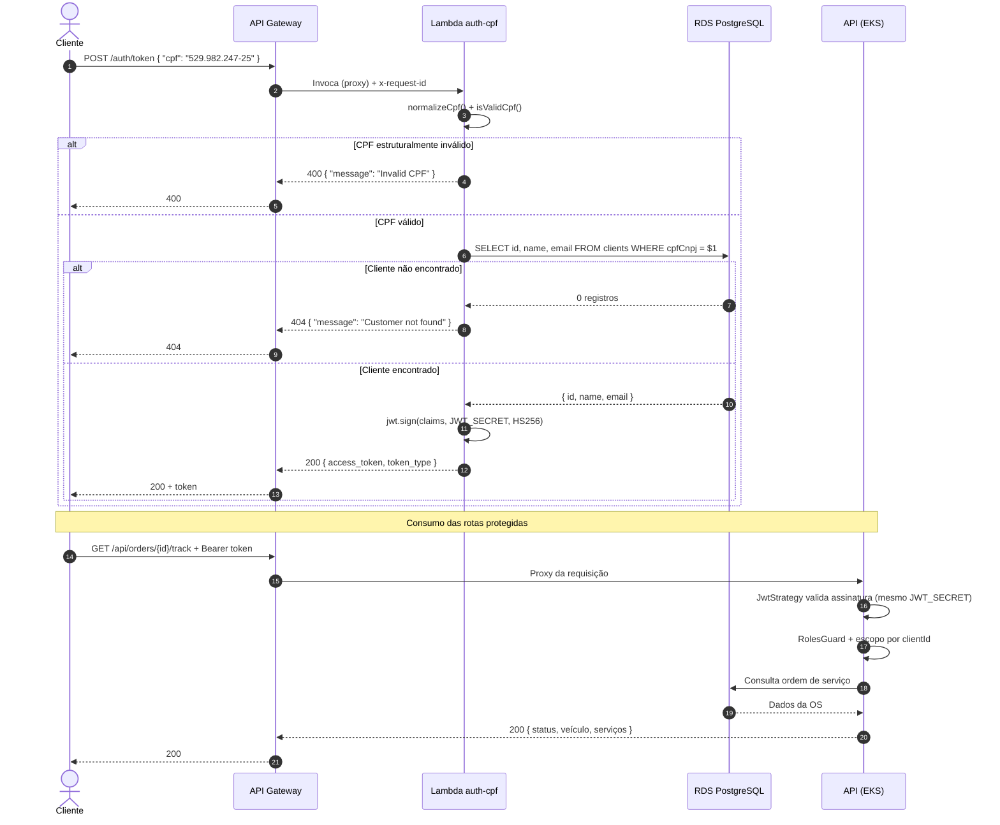
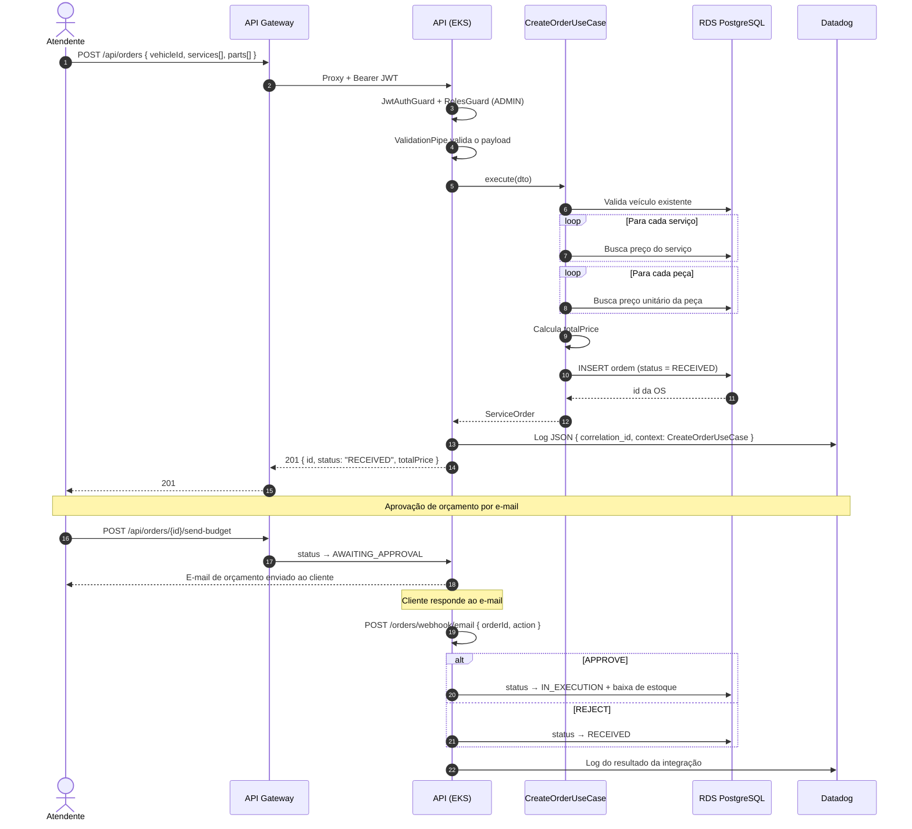

# Diagramas de Sequência

## 1. Autenticação via CPF (serverless)

```mermaid
sequenceDiagram
    autonumber
    actor C as Cliente
    participant GW as API Gateway
    participant L as Lambda auth-cpf
    participant DB as RDS PostgreSQL
    participant API as API (EKS)

    C->>GW: POST /auth/token { "cpf": "529.982.247-25" }
    GW->>L: Invoca (proxy) + x-request-id
    L->>L: normalizeCpf() + isValidCpf()

    alt CPF estruturalmente inválido
        L-->>GW: 400 { "message": "Invalid CPF" }
        GW-->>C: 400
    else CPF válido
        L->>DB: SELECT id, name, email FROM clients WHERE cpfCnpj = $1
        alt Cliente não encontrado
            DB-->>L: 0 registros
            L-->>GW: 404 { "message": "Customer not found" }
            GW-->>C: 404
        else Cliente encontrado
            DB-->>L: { id, name, email }
            L->>L: jwt.sign(claims, JWT_SECRET, HS256)
            L-->>GW: 200 { access_token, token_type }
            GW-->>C: 200 + token
        end
    end

    Note over C,API: Consumo das rotas protegidas
    C->>GW: GET /api/orders/{id}/track + Bearer token
    GW->>API: Proxy da requisição
    API->>API: JwtStrategy valida assinatura (mesmo JWT_SECRET)
    API->>API: RolesGuard + escopo por clientId
    API->>DB: Consulta ordem de serviço
    DB-->>API: Dados da OS
    API-->>GW: 200 { status, veículo, serviços }
    GW-->>C: 200
```

## 2. Abertura de Ordem de Serviço

```mermaid
sequenceDiagram
    autonumber
    actor A as Atendente
    participant GW as API Gateway
    participant API as API (EKS)
    participant UC as CreateOrderUseCase
    participant DB as RDS PostgreSQL
    participant DD as Datadog

    A->>GW: POST /api/orders { vehicleId, services[], parts[] }
    GW->>API: Proxy + Bearer JWT
    API->>API: JwtAuthGuard + RolesGuard (ADMIN)
    API->>API: ValidationPipe valida o payload
    API->>UC: execute(dto)

    UC->>DB: Valida veículo existente
    loop Para cada serviço
        UC->>DB: Busca preço do serviço
    end
    loop Para cada peça
        UC->>DB: Busca preço unitário da peça
    end

    UC->>UC: Calcula totalPrice
    UC->>DB: INSERT ordem (status = RECEIVED)
    DB-->>UC: id da OS
    UC-->>API: ServiceOrder
    API->>DD: Log JSON { correlation_id, context: CreateOrderUseCase }
    API-->>GW: 201 { id, status: "RECEIVED", totalPrice }
    GW-->>A: 201

    Note over A,DD: Aprovação de orçamento por e-mail
    A->>GW: POST /api/orders/{id}/send-budget
    GW->>API: status → AWAITING_APPROVAL
    API-->>A: E-mail de orçamento enviado ao cliente

    Note over API: Cliente responde ao e-mail
    API->>API: POST /orders/webhook/email { orderId, action }
    alt APPROVE
        API->>DB: status → IN_EXECUTION + baixa de estoque
    else REJECT
        API->>DB: status → RECEIVED
    end
    API->>DD: Log do resultado da integração
```
